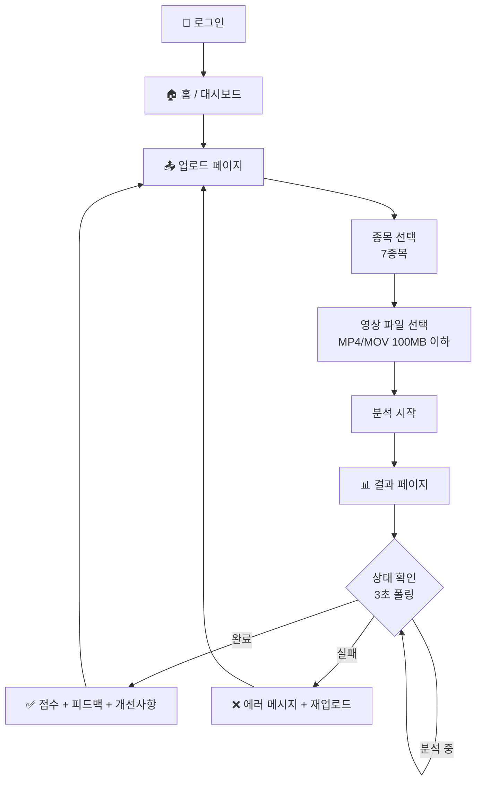

# MotionLab Frontend

> AI 스포츠 동작 분석 플랫폼 — 프론트엔드

---

## 📖 Overview

MotionLab의 웹 프론트엔드입니다. 사용자가 운동 영상을 업로드하고
AI 분석 결과를 확인할 수 있습니다.

**핵심 기능**:
- 🔐 JWT 기반 로그인/인증 (Zustand persist)
- 🏌️ 7개 종목 선택 + 영상 업로드
- ⏳ 실시간 분석 상태 폴링 (TanStack Query, 3초 간격)
- 📊 분석 결과 표시 (점수, 피드백, 개선사항, 각도)

---

## 🔄 User Flow



---

## 🛠️ Tech Stack


---

## 📁 Project Structure

```text
src/
├── app/                            # Next.js App Router
│   ├── (auth)/                     #   인증 그룹 (URL에 미포함)
│   │   ├── login/page.tsx          #     /login
│   │   ├── register/page.tsx       #     /register
│   │   └── layout.tsx
│   ├── (main)/                     #   메인 그룹 (URL에 미포함)
│   │   ├── result/
│   │   │   └── [motionId]/page.tsx #     /result/:motionId
│   │   ├── upload/page.tsx         #     /upload
│   │   ├── page.tsx                #     / (홈)
│   │   └── layout.tsx
│   ├── globals.css
│   └── layout.tsx                  #   Root Layout (QueryProvider)
├── components/
│   └── ui/                         # Shadcn/UI 컴포넌트
│       ├── button.tsx
│       ├── card.tsx
│       ├── input.tsx
│       └── label.tsx
├── constants/                      # 상수 (하드코딩 제거)
│   ├── api-endpoints.ts            #   API 경로
│   ├── config.ts                   #   앱 설정 (폴링 간격, 파일 크기)
│   ├── env.ts                      #   환경 변수
│   ├── messages.ts                 #   UI 메시지
│   ├── motion-status.ts            #   상태 enum
│   ├── routes.ts                   #   라우트 경로
│   └── score-ranges.ts             #   점수 등급
├── lib/
│   ├── api/                        # API 통신
│   │   ├── client.ts               #   Axios 인스턴스 (토큰 자동 첨부)
│   │   ├── auth.api.ts             #   인증 API
│   │   ├── motion.api.ts           #   Motion API
│   │   └── sport.api.ts            #   종목 API
│   ├── hooks/                      # Custom Hooks
│   │   ├── use-auth.ts
│   │   ├── use-motion.ts
│   │   ├── use-motion-polling.ts   #   폴링 (TanStack Query refetchInterval)
│   │   ├── use-sports.ts
│   │   └── use-upload.ts
│   ├── providers/
│   │   └── query-provider.tsx      #   TanStack Query Provider
│   ├── store/                      # Zustand 상태 관리
│   │   ├── auth.store.ts           #   JWT + 유저 정보 (persist)
│   │   └── motion.store.ts         #   종목 선택 상태
│   └── utils/
│       ├── cn.ts                   #   Tailwind 클래스 병합 (Shadcn/UI)
│       ├── format.ts               #   포맷팅 유틸
│       └── token.ts                #   토큰 유틸
└── types/                          # TypeScript 타입
    ├── api.ts                      #   ApiResponse, ApiError
    ├── auth.ts                     #   Login, Register, UserInfo
    ├── analysis.ts                 #   AnalysisResult, Improvement
    └── motion.ts                   #   MotionListItem, MotionDetail
```

---

## 🚀 Quick Start

### Prerequisites

- Node.js 18+
- pnpm 8+

### Installation

```bash
git clone https://github.com/{username}/motionlab-front.git
cd motionlab-front
pnpm install

# 환경 변수
cp .env.example .env.local
# NEXT_PUBLIC_API_URL=http://localhost:3000
```

### Running
```bash
pnpm dev    # http://localhost:4000
```

---

## 🔒 Security

- Access Token: Zustand 메모리 저장 (localStorage persist)
- Refresh Token: NestJS httpOnly 쿠키 (Phase 2)
- Server Actions 사용 안 함
- 인증 로직은 NestJS에서만 처리
- dangerouslySetInnerHTML / eval() 사용 금지
- 환경 변수: NEXT_PUBLIC_ 접두사만 브라우저 노출

---

## 🔗 Related Repositories

| Repository | Description | Stack |
|-----------|-------------|-------|
| motionlab-server | 백엔드 API | NestJS + TypeORM |
| motionlab-ai | AI 분석 서버 | FastAPI + MediaPipe |
| motionlab-front | 프론트엔드 **(현재 레포)** | Next.js 16 |
| motionlab-config | 종목별 기준값 관리 | CSV → JSON |